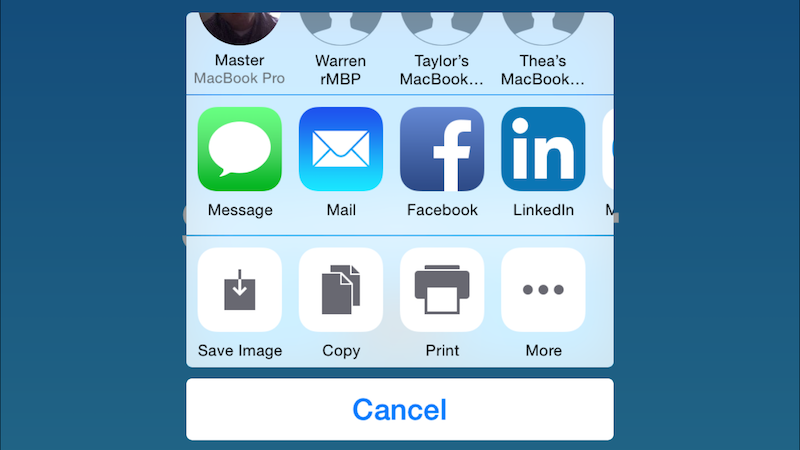
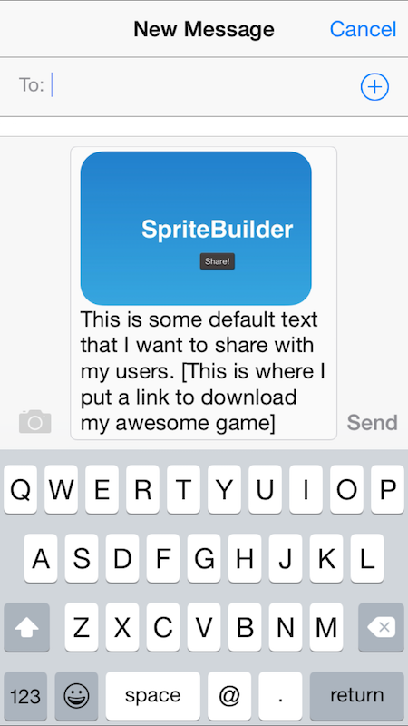

#Share Button
The following [repository](https://github.com/orcudy/ShareButtonDemo) contains sample code for implementing a share button using SpriteBuilder and Swift.

When the share button is tapped, a number of options for sharing are available (these are set by the user). When a user chooses to share, when possible, the message will be pre-populated with default text and a screenshot.

####Share Button Tapped

####Sharing Via Message

