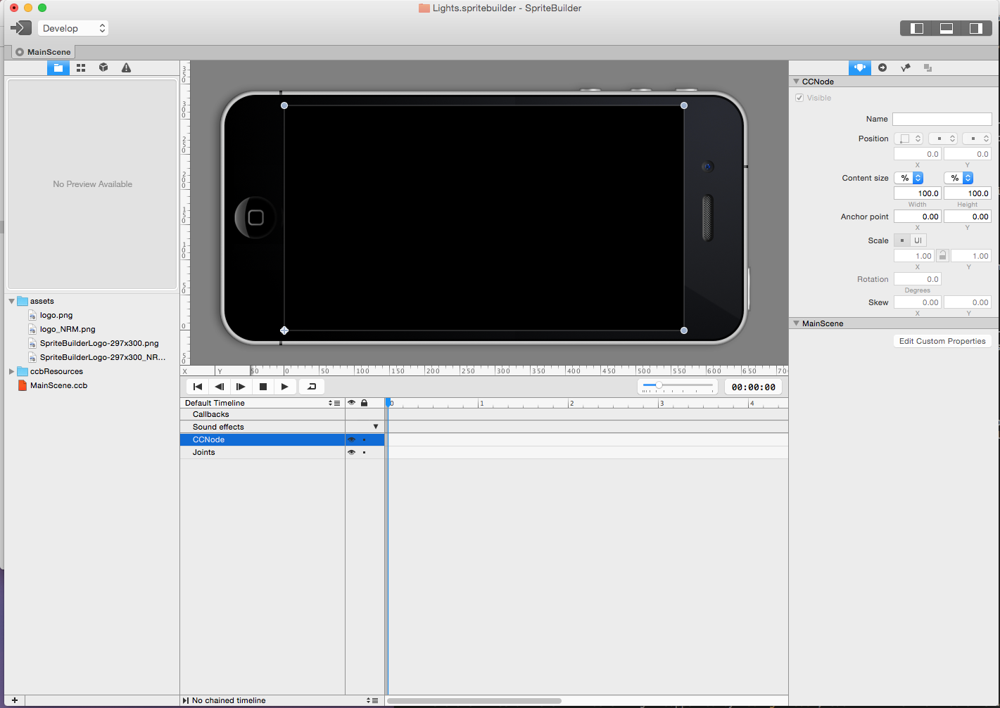
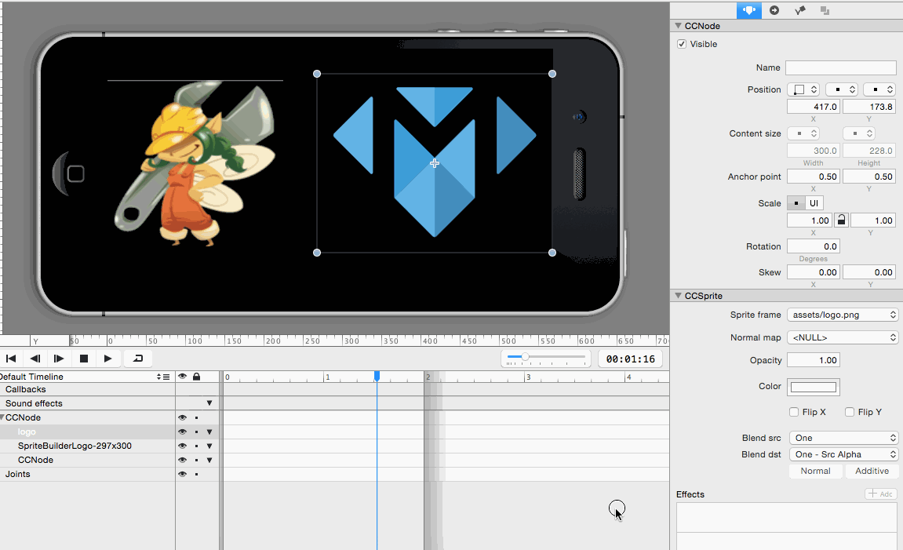
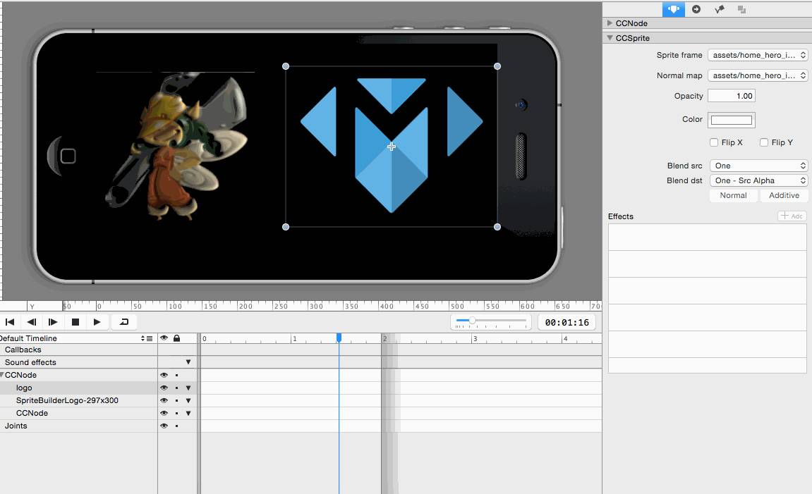

Cocos2D continues to impress with a growing list of features.  With the release of Cocos2D 3.4 comes *CCLightNode* and the ability to easily add dynamic lighting to a scene.  SpriteBuilder 1.4 has integrated this feature and provides a real time preview.  This tutorial will introduce you to the steps required to include this in your next game.  Let's get started.

#Getting started

Let's make sure you have the right tools to make the lighting effects today.  You will need Xcode, of course.  Verify you have at least version 1.4 of SpriteBuilder (in the [App Store](https://itunes.apple.com/us/app/spritebuilder/id784912885?mt=12)).  This comes prepackaged with Cocos2D 3.4, so you're almost ready.  You need one more tool to generate normal maps for sprites that will have the lighting effects.

> [info] What's a normal map?
>
> A normal map is an image file that uses different colors to describe the surface of an object. Normal maps are used to simulate 3D effects, such as shadows or refraction of light on a sprite that is actually flat ([more info](http://en.wikipedia.org/wiki/Normal_mapping)).  
>

There is a tool that is currently free while its in beta, called CrazyBump.  Go ahead and download it [here](http://crazybump.com/mac/).  That's all you need!  Now to create the normal maps.

#Creating normal maps

Go ahead and fire up CrazyBump.  This tool automates most of the normal map generation, so there isn't much to do besides provide a source file.  Here's a quick walkthrough:

Feel free to experiment with the normal map sliders to observe how they influence the map.  We'll provide a couple assets and normal maps ([download here]()) or you can make your own.  Now you're ready to set the scene with SpriteBuilder.

#SpriteBuilder

1. create a new project
2. remove template elements
3. add assets to file view
4. drag image(s) onto timeline
5. add corresponding normal map
6. add lighting effect to ccsprite
7. add CCLightNode to timeline
8. explain different light types
9. code connection for cclightnode

Create a new project in SpriteBuilder with Swift as the primary language.  We won't need the label or gradient background, remove those.  Drag the assets into the project's file view.  The project should resemble something like this:

Drag the assets (not the normal maps) onto the scene.  You're going to add the normal map to the *CCSprite* that was created when the asset was added to the timeline.  If you have worked with SpriteBuilder for a while, you may have noticed the new properties available for *CCSprite*.  The map is added to the normal map property of each sprite.  

After that, add a lighting effect to the sprite.  This is done by clicking the "+ Add" button and selecting "Lighting" at the bottom of the list.  This will result in an immediately noticable change in the preview in the timeline.

To get immediate feedback you can add a light node to the scene with SpriteBuilder.  Drag one from the node library onto the timeline.  You are now lighting the scene!  

> [info]
>
> There are three different kinds of light supported by *CCLightNode*, each with their own behavior.  There is diffuse light, specular light, and ambient light.
> 
> - Diffuse light: Soft lighting on the surface of objects
> - Specular light: Reflected light, directly influenced by a sprites shininess and specular color properties
> - Ambient light: Background light that equally lights entire sprite
> 
> Try adjusting each property and see how it affects the sprites.

Finally, add a doc root var code connection to the light node so it can be accessed in code.  Let's switch over to Xcode and add a little interactivity!

#Xcode

With everything set up in SpriteBuilder, it is now time to add an interactive component.  Click File > Open Project in Xcode to switch over to Xcode.  Add a little code to MainScene.swift that updates the position of the light node that was created.  Here's a template to build off of:

	class MainScene: CCNode {
		
		//code connected light node, must match doc root var!
		var lightNode: CCLightNode!
		
		func didLoadFromCCB() {
			userInteractionEnabled = true
		}
		
    	override func touchBegan(touch: CCTouch!, withEvent event: CCTouchEvent!) {
    		let touch = touch.locationInNode(self) as CGPoint
    		
    		lightNode.position = touch
    	}
	
	}
	
Adding this code will update the light's position every time the screen is touched.  Run the project, it should look similar to this:

I suggest going back and updating the properties of the light node and see how they influence the scene.
	
#Summary

