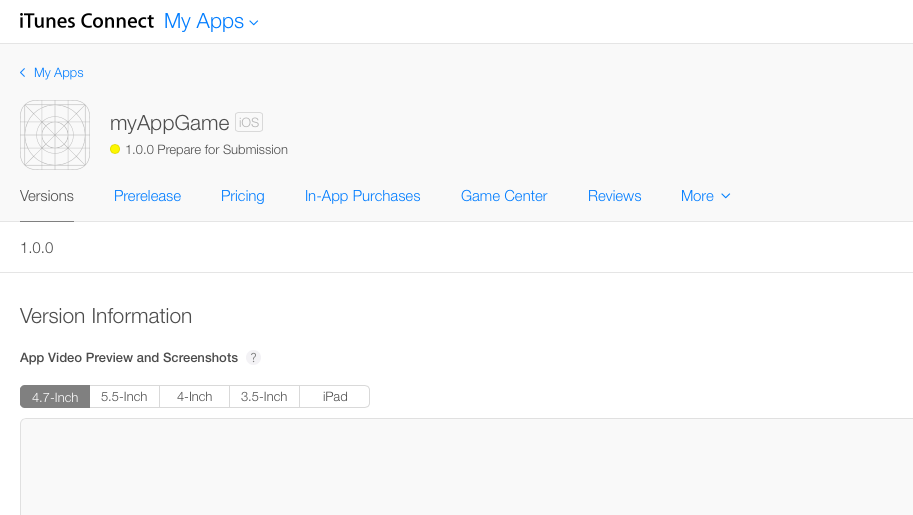

Requirements for IAP:

1: Apple Developer Account (assumption?)
2. App is added to "My Apps" in iTunes Connect (assumption?)
3. App has IAP entry as part of app
4. StoreKit framework and code
5. sandbox apple account for testing
6. reporting

As your product nears readiness for the App Store, the thought may have crossed your mind to try to make some money off your app or game.  There are two mechanisms: up front purchase cost and in app purchases.  Up front purchase will ensure that you make some money with each download, but vasty decreases download count.  Its much more common (and profitable) to make the download free, but offer things to buy once the user is engaged with the product.  This tutorial will walk through the steps required to add an in app purchase, or IAP, to your app or game.  We will start with a couple assumptions: you already have an Apple developer account and the app is already added to your developer account in iTunes Connect.  The first step is documenting the purchase in iTunes Connect.

#Getting Started

Sign on to iTunes Connect and navigate to "My Apps".  Select the app that you want to add the IAP to.  You should see something similar to this:

Navigate to the In-App Purchase tab and create a new IAP.  Now its time to choose what kind of IAP your product will offer.  Apple provides five different IAP options, grouped into subscription and consumable types.  You will probably choose the one of the consumable types, and it's important to know the difference.  

Consumable purchases provide a benefit once, say some extra coins to spend.  Non-Consumable purchase provide a permanent benefit, like unlocking a new character.  Consumable purchases cannot be restored.  Non-consumable purchases can be restored, and Apple requires an app to allow customers to restore these purchases.  

#Write the Code

With the IAP listed in iTunes Connect it's time to implement the purchase of the product.  The code is tricky and can be difficult to follow, but we'll provide some functioning code to build off of.  We'll be using Apple's StoreKit framework to fetch information, request and then execute purchases.

The first step is to use the *SKPaymentQueue* and *SKProductsRequest* classes to start the process.  This step has two tasks: check if a purchase is possible and then start a product request lookup based off of some string.  Here's an implemented example of the step:

		//called by you, to start purchase process
		func attemptPurchase(productName: String) {
            if (SKPaymentQueue.canMakePayments()) {
                var productID:NSSet = NSSet(object: productName)
                var productRequest:SKProductsRequest = SKProductsRequest(productIdentifiers: productID)
                productRequest.delegate = self
                productRequest.start()
            } else {
                //notify user?
            }
        }
        
Reviewing the code reveals that we need to set a delegate as part of the process.  The protocol for this delegate is *SKProductsRequestDelegate*.  This delegate will call back once the _productRequest_ object finished its task.  The function it calls back it is productsRequest(request: SKProductsRequest!, didReceiveResponse response: SKProductsResponse!), so implementing it is required to conform to the protocol.  

The function gives back the original request and a *SKProductsResponse* object, which contains the results of searching for the string you initially provided.  If the string matches the productID entered in iTunes Connect, the *SKProductsResponse* object will contain (among other things) an array which contains a *SKProduct* object.  We can use this object to continue the purchase process.  

		// SKProductsRequestDelegate method
      	func productsRequest(request: SKProductsRequest!, didReceiveResponse response: SKProductsResponse!) {
      		var count: Int = response.products.count
      		if (count > 0) {
	           var validProducts = response.products
	           var product = validProducts[0] as SKProduct
			   buyProduct(product)
      		} else {
   				//something went wrong with lookup, try again?
			}
		}

Now that you have a valid *SKProduct* object, you can now offer the product to the user to buy.    Construct an *SKPayment* object out the product.  The payment is processed through the *SKPaymentQueue* class, and calls back through another protocol.  This protocol is called *SKPaymentTransactionObserver*.  The class provides a singleton, _defaultQueue()_, to set up the observer and start the payment process.  

        //called after delegate method productRequest
        func buyProduct(product: SKProduct) {
            var payment = SKPayment(product: product)
            SKPaymentQueue.defaultQueue().addTransactionObserver(self)
            SKPaymentQueue.defaultQueue().addPayment(payment)
        }

xxx

        //SKPaymentTransactionObserver method
        func paymentQueue(queue: SKPaymentQueue!, updatedTransactions transactions: [AnyObject]!) {
            println("recieved response")
            for transaction: AnyObject in transactions {
                if let tx: SKPaymentTransaction = transaction as? SKPaymentTransaction {
                    switch tx.transactionState {
                    case .Purchased, .Restored:
                        println("product purchased/restored")
                        queue.finishTransaction(tx)
                    case .Failed:
                        println("oops, purchase failed!")
                        queue.finishTransaction(tx)
                    case .Purchasing, Deferred:
                        println("waiting for completion..."
                    }
                }
            }
        }

#Testing and Reporting

#Summary

